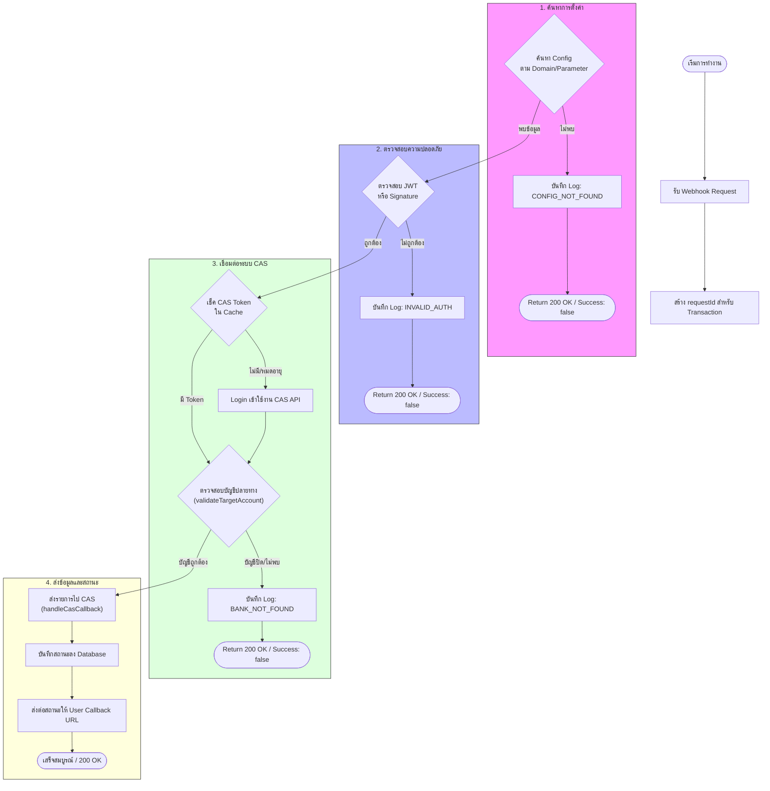

# ภาพรวมโมดูลการจัดการธนาคาร (Bank Adapter Module Overview)

เอกสารฉบับนี้อธิบายโครงสร้างและการทำงานของระบบ **Bank-Adapter-v2** ซึ่งทำหน้าที่เป็น Middleware เชื่อมต่อระหว่าง Payment Gateways และระบบ **CAS (Central Account System)**

---

## 🔹 Overview (ภาพรวม)

โมดูลนี้ทำหน้าที่เป็นตัวกลาง (Adapter) ในการรับข้อมูลจากผู้ให้บริการชำระเงินภายนอก (เช่น TrueMoney, BibPay, PayOneX) เพื่อนำมาตรวจสอบ และส่งต่อข้อมูลรายการไปยังระบบหลังบ้าน (CAS) เพื่อทำการปรับยอดเงิน (Deposit/Withdraw) โดยอัตโนมัติ

**หน้าที่หลัก:**
1.  **Webhook Handling**: รับและประมวลผลข้อมูลจาก Gateway ต่างๆ แบบ Real-time
2.  **Verification**: ตรวจสอบความถูกต้องของข้อมูล (JWT Verification, Signature Check) เพื่อป้องกัน Webhook ปลอม
3.  **CAS Integration**: เชื่อมต่อกับระบบ CAS เพื่อทำ Authentication และตรวจสอบเลขบัญชีธนาคาร
4.  **Forwarding**: ส่งต่อสถานะรายการที่สำเร็จไปยังระบบของลูกค้า (User Callback)

---

## 🔹 การทำงาน (Flow)

กระบวนการหลักคือการรับ Webhook และตรวจสอบก่อนส่งเข้าระบบ CAS

### Flowchart: Webhook Processing Logic (TrueMoney & General)

---

## 🔹 โครงสร้างระบบ (System Structure)

ระบบประกอบด้วย Component สำคัญดังนี้:

1.  **API Routes**:
    -   `POST /true-money/:parameter`: **(Gateway ใช้งาน)** Endpoint หลักสำหรับรับ Webhook จาก TrueMoney
    -   `POST /payonex/webhook`: **(Gateway ใช้งาน)** สำหรับรับรายการจาก PayOneX
    -   `POST /bibpay/webhook`: **(Gateway ใช้งาน)** สำหรับรับรายการจาก BibPay
    -   `POST /deposit`: **(User ใช้งาน)** สำหรับสร้างรายการฝากเงิน
    -   `POST /withdraw`: **(User ใช้งาน)** สำหรับสร้างรายการถอนเงิน

2.  **Core Services**:
    -   `src/payment/controllers/webhook.controller.ts`: ควบคุม Flow การรับ Webhook และการตรวจสอบเบื้องต้น
    -   `src/lib/cas-api-utils.ts`: จัดการการสื่อสารกับ CAS API ทั้งหมด (Auth, Validation, Callback)
    -   `src/payment/services/payment.service.ts`: จัดการ Business Logic และการบันทึก Database

---

## 🔹 Database (ฐานข้อมูล)

ใช้ฐานข้อมูล **PostgreSQL (Prisma)** โดยมี Table ที่เกี่ยวข้องดังนี้:

| Table Name | Description | Role in Module |
| :--- | :--- | :--- |
| `bo_token` | ข้อมูล Master Token | เก็บ Config หลัก, CAS Credentials และสถานะเปิด/ปิดระบบของลูกค้า |
| `bo_webhooks` | การตั้งค่า Webhook เฉพาะโดเมน | เก็บ `target_domain` และ `true_secret` สำหรับใช้ถอดรหัส JWT |
| `payment_deposits` | รายการฝากเงิน | บันทึกข้อมูลการฝากเงิน (Amount, Status, Bank No.) เพื่อรอการยืนยัน |
| `payment_withdraw` | รายการถอนเงิน | บันทึกประวัติการถอนเงินที่ส่งไปยัง Gateway |
| `payment_webhooks` | ข้อมูลดิบจาก Webhook | เก็บ Log ข้อมูล JSON ทั้งหมดที่ส่งมาจาก Gateway เพื่อใช้ตรวจสอบย้อนหลัง |

---

## 🔹 Configuration (การตั้งค่า)

-   `DATABASE_URL`: เชื่อมต่อฐานข้อมูล
-   `CAS_API_BASE`: (ใน DB) URL ปลายทางของระบบ CAS สำหรับส่ง Notification
-   `true_secret`: (ใน DB) คีย์สำหรับถอดรหัส JWT ของ TrueMoney ประจำเว็บไซต์นั้นๆ
-   `requestId`: ระบบ Tag ID อัตโนมัติ (เช่น `TRU-171094...`) สำหรับติดตามรายการใน Log

---

## 🔹 Integration (การเชื่อมต่อภายนอก)

1.  **Payment Gateways**: BibPay, PayOneX, TrueMoney (Webhook & API)
2.  **CAS API**: 
    -   `/admin/login` (Authentication)
    -   `/banks` (Account Matching)
    -   `/deposit/v2/central-notification` (Notification Update)
3.  **User Callback**: ส่งข้อมูลสถานะรายการกลับไปยังระบบของลูกค้าโดยตรง
